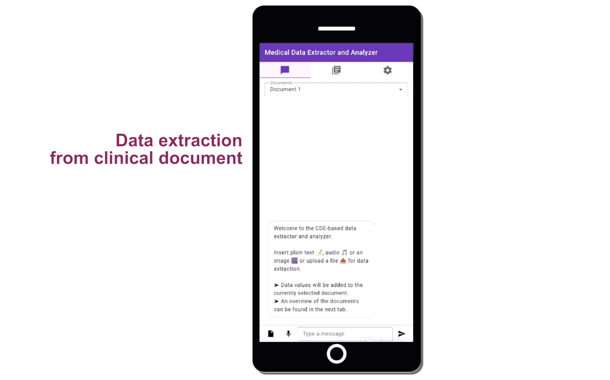
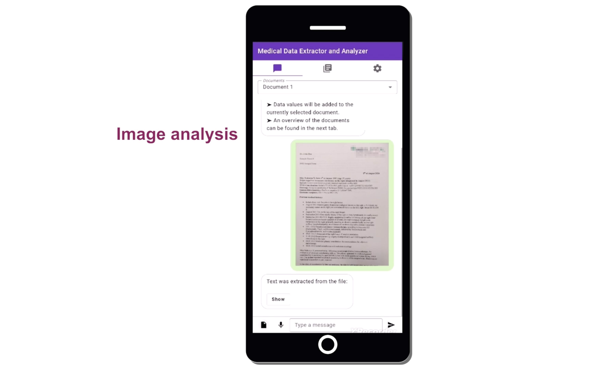
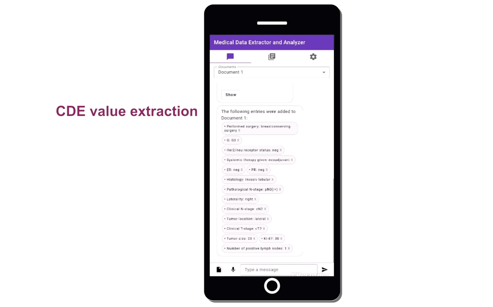
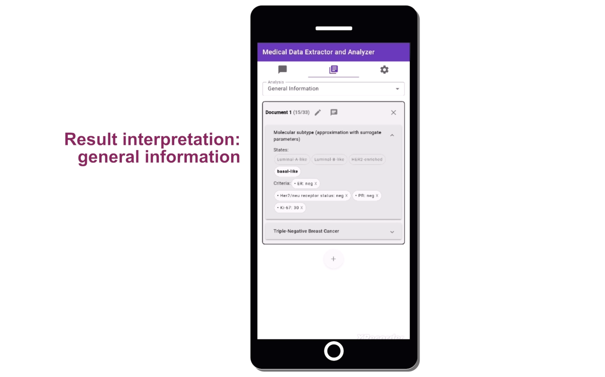
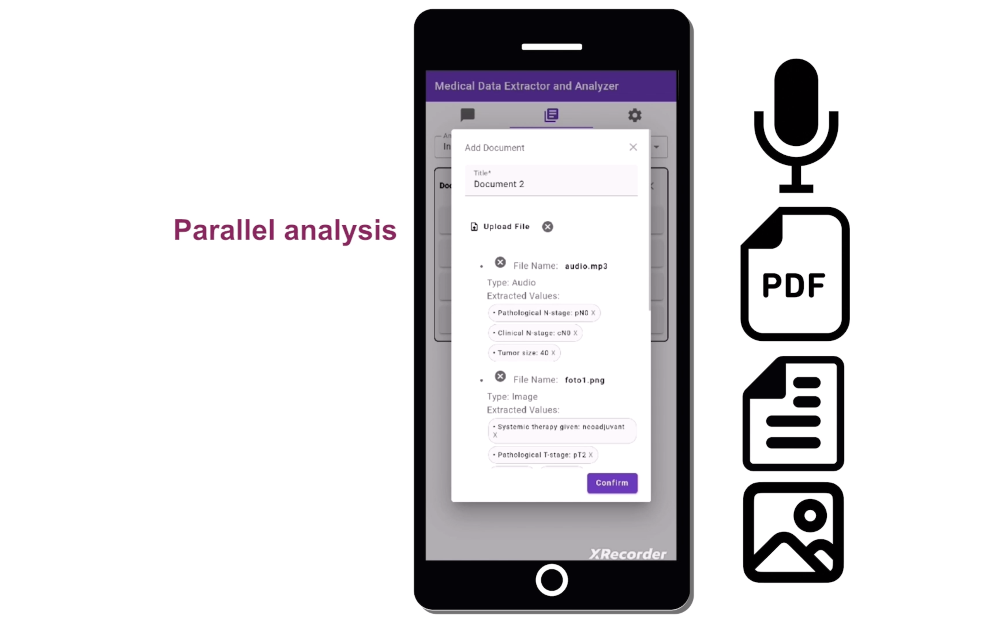

# Data Extractor and Inference Engine

Prototype for an Angular (web frontend) application for data management, primarily (but not exclusivly) in the medical domain.

## What is this project about?

This is a flexible multimodal (smartphone, tablet, PC) tool for
- extracting clearly defined common data elements (CDEs) from different media (plain text, pdf-documents, photos of doctor's letter, audios, etc.),
- managing multiple documents containing data to the CDEs, and
- rule-based inference of further CDEs and guideline evaluation.

## Related publication

Fabio Dennstädt, Maximilian Schmalfuss, Johannes Zink, Janna Hastings, Roberto Gaio, Paul Martin Putora, and Nikola Cihoric.
Creation of a CDE-based data structure for radiotherapeutic decision-making in breast cancer.  In *UICC World Cancer Congress (WCC’24)*, 2024.
Scientific Abstract.
[https://www.worldcancercongress.org/sites/congress/files/atoms/files/991.pdf](https://www.worldcancercongress.org/sites/congress/files/atoms/files/991.pdf)

Winner of the *best scientific abstract award* at the world cancer congress 2024:
- [https://www.worldcancercongress.org/programme/wcc-2024-awards](https://www.worldcancercongress.org/programme/wcc-2024-awards)
- [https://radioonkologie.insel.ch/de/aktuell/aktuelles/details/news/fabio-dennstaedt-erhaelt-den-best-scientific-study-award-am-world-cancer-congress-2024](https://radioonkologie.insel.ch/de/aktuell/aktuelles/details/news/fabio-dennstaedt-erhaelt-den-best-scientific-study-award-am-world-cancer-congress-2024)

## Persons involved in devoloping this prototype

Fabio Dennstädt
 
[Johannes Zink](https://www.informatik.uni-wuerzburg.de/algo/team/zink-johannes/)
 
Max Schmerder
 
Nikola Cihoric

## Technical details and quickstart guide

This project was generated with [Angular CLI](https://github.com/angular/angular-cli) version 16.2.14.

Run `ng serve` for a dev server. Navigate to `http://localhost:4200/`. The application will automatically reload if you change any of the source files.

Run `ng build` to build the project. The build artifacts will be stored in the `dist/` directory.

To get more help on the Angular CLI use `ng help` or go check out the [Angular CLI Overview and Command Reference](https://angular.io/cli) page.
